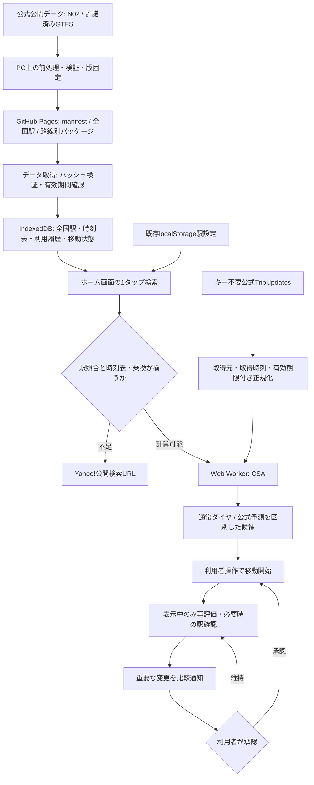

# Quick Route Next 技術設計

設計・実装基準日：2026-10-01。React / TypeScript / Vite / PWA / GitHub Pagesを維持。利用費0円、バックエンド・有料API・秘密キーなし。全国駅検索と、自前で計算できる時刻表範囲は別の機能。

## 全体構成とデータフロー

## モジュールの責務

| モジュール | 責務・境界 |
|---|---|
| `stations.ts` | 既存v1の設定を読み書き。名前を維持し、候補選択時のみ全国駅IDを付加 |
| `StationInput.tsx` / `rail/stationCatalog.ts` | 遅延読み込み、駅名・会社・路線候補、表記正規化、同名駅の明示選択 |
| `rail/model.ts` | 駅・事業者・路線・運行日・例外日・時刻・乗換・出典・鮮度・範囲・情報種別 |
| `scripts/prepare_data.py` | 公式ZIPを共通形式へ変換。推定時刻を補わない。公開可能な静的データだけ処理 |
| `rail/storage.ts` | IndexedDBの開閉・トランザクション、版の置換、利用履歴、移動状態 |
| `rail/offline.ts` | manifest、SHA-256、構造検証、有効期限、保存優先度、容量・破損復旧 |
| `rail/router.ts` / Worker / planner | 運行日展開、最速到着・別列車候補、乗降条件、確定乗換のみのCSA |
| `rail/realtime.ts` | 公開TripUpdatesの取得、protobuf正規化、古い・未知・差分応答の拒否 |
| `rail/intelligence.ts` | 公式運休・発着予測・乗換失敗の判定、明示what-if、通知抑制 |
| `JourneyPanel.tsx` | 候補・移動モード、ユーザー確認、GPSの最小処理、復帰・承認操作 |
| `routing.ts` | Yahoo!公開URL。遷移の瞬間にJST時刻を取得し到着順を指定 |

## データモデル・全国駅

全国駅のIDはN02駅コードを名前空間 `n02:` と共に使用。駅名だけを主キーにしない。事業者・路線を配列で保持。国土数値情報の駅グループを乗換可能と推測しない。NFKC、空白、駅接尾辞、ヶ／ケの揺れは検索上のみ正規化する。カナ読みが提供されていないので、全駅の読み検索は未対応。異なる同名駅は候補の会社・路線を見て選ぶ。古い文字列設定は壊さず、一意に照合できない場合は外部検索。

GTFSの駅ID・列車ID・路線IDはパッケージ名前空間付き。service dateと、日内秒（24時超対応）を保持。カレンダー例外を週次カレンダーより優先する。乗降禁止、無停車通過、運休日を反映する。異なるIDの直通列車は公式の連続乗車情報が必要で、曖昧なblock_idだけで継続乗車と断定しない。

| IndexedDB store | キー | 内容・更新方法 |
|---|---|---|
| meta | `manifest` | 出典・版・公開URL・ハッシュ・サイズ・有効期間・対象駅。取得失敗時の復旧用 |
| meta | `stations`, `stationVersion` | 全国駅と版を同一トランザクションで置換 |
| packages | パッケージID | 共通時刻表、bytes、savedAt、lastUsed。検証完了後のみ全体置換 |
| usage | 出発／到着の組 | 端末内検索回数と最終時刻、100組上限。位置・外部サービスの履歴は収集しない |
| meta | `journey` | 選択経路・開始時刻・休止／開始・最後の評価・確認した駅ID。GPS座標の履歴は保存しない |

localStorageの既存駅設定は維持。IndexedDBが失われても駅設定を使って外部検索し、公開データを再取得する。DB自体の利用が拒否された場合も、駅の手入力とYahoo!検索を維持する。

## 分割・保存・更新フロー

初期全国駅は約10,154レコード。時刻表は都営6路線の独立パッケージ。経路検索に必要な列車を分断する「駅ごとのstop_times切り出し」は行わない。今後複数路線をまたぐtripを追加するときは、そのtrip全体を含む原子的な配信単位へ変更する。

アプリ起動／設定変更／検索後にmanifestを確認する。ダウンロードしたサイズ・SHA-256・構造・出典・版・有効期間を検証し、完全取得後にDBへ置換する。更新失敗は有効な旧版を保持する。期限切れは現在の案内から除外。初回起動で全国時刻表を全ダウンロードしない。

優先度は登録駅、最近30日相当の時間減衰、検索頻度、共有駅を持つ公開パッケージで評価。共有駅の候補保存は「代替路線に関係するデータ」であり、乗換許諾がない経路を計算可能にしない。lastUsedは検索で使用したパッケージを更新する。

容量はStorage APIのquota/usageから、全quotaの10%、最大64MiB、空きの5%または4MiBの余裕を考慮。APIがない場合は16MiBを暫定上限とする。ユーザーに容量設定を要求しない。期限切れ→低優先度→長期未使用の順で整理。QuotaExceededErrorなら低優先度を削除し、次回更新で再試行。有効な旧版を部分ダウンロードで上書きしない。永続化要求は駅保存操作時に行うが、成功・保持を保証しない。

公開manifestに汎用差分プロトコルはないため、**現在の実装は版変更時に変更パッケージだけ全体取得**する。差分サポートを装わない。今後は基底版ハッシュ・差分ハッシュ・結果ハッシュを揃えられるデータに限定して追加し、失敗時は完全取得へ戻す。

## 経路検索と方式比較

| 方式 | 利点 | 負担・条件 | 判断 |
|---|---|---|---|
| CSA | 発車順のconnection走査。日付展開・遅延再ソートが明示的、小さいGTFS単位で検証しやすい | 同じ列車の継続、乗降・乗換条件、候補labelを正しく管理する必要 | 今回採用、独自実装、Worker内 |
| RAPTOR | 乗換ラウンドごとに路線を走査。乗換数と到着を比較しやすい | 路線パターン・追越し・リアルタイム時刻の索引が必要 | 全国の実時刻表が増えた場合に再比較。既存GPLライブラリを無断組込みしない |
| 通常の距離Dijkstra | 駅間距離の計算が簡単 | 運行日・待ち時間・終電・乗換失敗を表さない | 列車経路の最速判定には採用しない |

1. タップ時刻を取得し、登録した駅IDまたは一意な駅名を全国駅に照合。
2. 保存済みの有効パッケージを読み、会社・名称・500m以内の座標でGTFSの同一駅を照合。この距離はID照合の検査用で、歩行接続ではない。
3. 前日・当日・翌日service dateを展開し、24時超の列車を実時刻へ変換。出発から36時間を上限とする。
4. 有効な公式予測・運休を反映し、発車順にCSAを走査。同一tripの継続は乗換不要。異なるtripへは出典付きtransferを必須とする。
5. 到着順・乗換数・出発順で候補を比較し最大8件を返す。画面には初期4件。後続列車で同時刻着なら明示する。
6. 候補がない／駅照合不可／破損／必要データ不足の場合、オンラインならYahoo!に引き継ぐ。オフラインなら不足を知らせ、架空候補を表示しない。

候補は「保存済みデータ内」。未収録の全国経路との最速比較はできない。完全なネットワークの最速保証、同一候補の後続列車以外を含む全経路列挙、異なるパッケージ間の乗換は初期版未対応。実収録データのtransfersが空なので、現在は主に同一列車区間を案内する。

## 遅延・乗換・シミュレーション

通常ダイヤ、公式運休、公式発着予測、独自what-if、情報未取得を区別する。初期の公式入力はキー不要の都営TripUpdates。最低60秒間隔、10秒取得タイムアウト、最大5MiB。フィード生成120秒後に期限切れとするこれはアプリ側の保守的な鮮度基準で、提供元の更新保証ではない。初回検索は最大800msのRT待ちで通常ダイヤ計算へ進み、移動モードで再評価する。

trip IDに加えservice date一致が必要。未知列車・不明日・不完全な差分フィードは使用しない。時刻の矛盾がある列車は自前結果に採用しない。route全体のAlertだけで列車ごとの遅延秒数を生成しない。初期版はAlertの汎用取り込み、全国列車位置、過去の遅延履歴モデルを未対応と明記する。

乗換は公式の到着予測＋確認済み乗換時間が、次の公式出発予測を超えた場合に失敗と判定する。予測または乗換時間が不足すれば不明。運休列車は候補から除き、対応範囲内で後続・迂回候補を再計算する。独自what-if関数は利用者が明示した遅延秒数だけを使いsimulationとする。確率・解消時刻の根拠がないため、予測確率や勝手な将来シナリオはUIで有効化しない。

## 表示中の追跡・通知

経路選択→「この経路で移動を開始」の明示操作。GPSは別の操作で許可を求め、低精度なら駅・列車を断定しない。近くの駅は候補として利用者に確認してもらう。座標は端末メモリだけ。GPS拒否時は現在の駅を選択できる。

表示中の60秒間隔・運行情報更新・駅確認を再評価の契機とする。利用者確認なしに乗車列車を断定しない。位置不明なら代替候補の実行可能性を断定しない。hiddenでintervalとGPS watchを停止し、休止状態を保存。復帰時に更新し、現在の駅を再確認する。永続的なGPS軌跡、常時通知サーバー、背景追跡の保証はない。

通知はアプリ内。公式の運休・乗換失敗、または確認した駅から5分以上早い代替を対象とする。同内容fingerprintを重複抑制し、通常の改善通知は5分cooldown。候補の出典・到着差・理由を表示し、**「この変更を承認する」まで選択経路を変更しない**。Push/OS通知は初期版未対応。小さい差だけで頻繁に知らせない。

## エラー・検証・段階依存

| 機能 | 前提・難易度 | 不成立時の代替 |
|---|---|---|
| 全国駅検索（段階1） | N02許諾、既存設定互換。中 | 手入力・Yahoo! |
| 自動保存（段階2） | 再配布許諾、DB・容量・整合性検査。高 | 保存済み有効版またはYahoo! |
| 独自CSA（段階3） | 完全な列車時刻・運行日、必要な乗換。高 | データ不足を判定し外部検索 |
| 遅延分析（段階4） | 公開API、ID一致、鮮度、個別予測。高 | 通常ダイヤ／情報未取得と表示 |
| 移動・通知（段階5） | 段階3・4、明示開始、現在駅確認。高 | GPSなし確認操作、外部比較 |
| 品質・性能（段階6） | 前段の実データと例外テスト。高 | 実機未検証を残し、未保証機能を無効化 |

単体：運行日、終電、日付変更、同一trip、乗換時間、乗降禁止、情報鮮度、破損、容量、通知重複。結合：設定互換、実GTFS照合、取得→検証→保存→読み込み→更新→削除、位置拒否、承認。ブラウザ：本番ビルド、320px/light/dark、SWオフライン、保存データ削除復旧、全国候補・フォールバック。

CIはPRの型チェック・テスト・Lint・本番ビルド、mainの既存Pagesデプロイを維持。データ更新は公式URLから前処理を手動実行し、manifest差分・実データテスト・利用許諾をレビューしてから公開する。APIキーをCIから静的JSに埋め込まない。性能は同一PC・同一ブラウザ・同一URL条件で旧版と比較し、デスクトップの数値をiPhone電池・CPUの測定値と扱わない。
